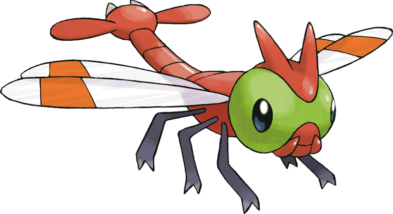

# YANMA - Yet ANother Monolithic Applicattion

*#193 - Yanma : [Bug/Flying]. YANMA is capable of seeing 360 degrees without having to move its eyes. It is a great flier that is adept at making sudden stops and turning midair. This POKéMON uses its flying ability to quickly chase down targeted prey.*

Aplicação Monolítica para apresentação sobre quebra de Monolítos em Microserviços

## Descrição da Aplicação

Aplicação hipotética de aluguel de bikes compartilhadas. Um usuário cadastrado pode selecionar uma bicicleta que está em uma estção e utilizar um código fornecido pela aplciação para destravá-la e sair com ela. Ao final da viagem, o usuário deve devolvê-la a qualquer estação.

### Casos de uso

os casos de uso podem ser vistos [aqui](documentation/use_cases.md).
